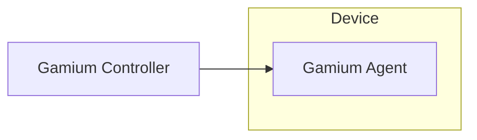

# 소개
gamium은 게임플레이를 자동화합니다. 그게 전부입니다. gamium을 통해 게임유저의 행동을 스크립트화 할 수 있습니다.
UI를 클릭하는 단순한 기능부터 시작해 다양한 케이스를 자동화하고 수 많은 반복테스트에서 벗어나세요.

gamium은 게임 플레이를 시뮬레이션 하기위해 Gamium Agent와 Gamium Controller라는 두 가지 컴포넌트를 개발했습니다.  
Gamium Agent는 게임의 상태를 알리고, 게임에 가상입력을 실행하는 역할을 합니다. Gamium Controller는 Gamium Agent에게 게임 상태를 질의하거나 가상입력을 요청합니다.  
Gamium Agent를 게임에 포함하고, Gamium Controller가 제공하는 API를 사용하면 원하는 테스트 스크립트를 작성할 수 있습니다.

